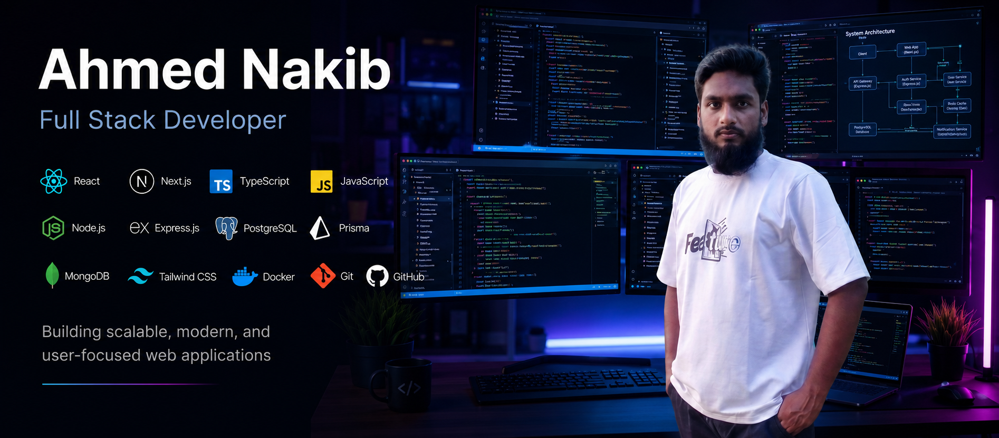

<!-- ===================================================== -->
<!--                    HERO SECTION                        -->
<!-- ===================================================== -->

<p align="center">
  
</p>

<h1 align="center">
  Hi 👋, I'm <span style="color:#00C4FF;">Ahmed Nakib</span>
</h1>

<h3 align="center">
Frontend Developer • React • Next.js • TypeScript
</h3>

<p align="center">
  Passionate about building fast, scalable and user-friendly web applications with modern technologies.
</p>

<p align="center">
  
</p>

<br>

<p align="center">

<a href="office.nakib@gmail.com">

</a>

<a href="https://www.linkedin.com/in/nakibulislam2003/">

</a>

<a href="https://www.facebook.com/mohiuddin.nakib.9">

</a>

<a href="https://github.com/Ahmed-Nakib">

</a>

</p>

<p align="center">


</p>

---

# 👨‍💻 About Me

```yaml
Name: Ahmed Nakib

Role: Frontend Developer

Location: Bangladesh 🇧🇩

Currently Learning:
  - Advanced TypeScript
  - Next.js
  - Backend Development
  - System Design

Currently Building:
  - BloodLink
  - Bagddash
  - Learn With Nakib

Tech Stack:
  - React
  - Next.js
  - TypeScript
  - Tailwind CSS
  - Node.js
  - Express
  - MongoDB
  - PostgreSQL
  - Prisma ORM

Interested In:
  - Full Stack Development
  - Open Source
  - Scalable Web Applications

Goal:
  Become a Professional Full-Stack Software Engineer

Fun Fact:
  I enjoy turning ideas into real-world web applications.
```

---

## 🚀 What I'm Working On

- 🌱 Learning **Advanced TypeScript & Backend Architecture**
- ⚡ Building **Modern Full-Stack Applications**
- 🎯 Improving **Problem Solving & System Design**
- 🤝 Open to **Collaboration & Open Source**
- 💬 Ask me about **React, Next.js, TypeScript & Tailwind CSS**

---
<!-- ===================================================== -->
<!--                  TECH STACK                           -->
<!-- ===================================================== -->

# 💻 Tech Stack

## 🎨 Frontend Development

<p align="center">
  
</p>

---

## ⚙️ Backend Development

<p align="center">
  
</p>

---

## 🗄️ Database & ORM

<p align="center">
  
</p>

---

## ☁️ Cloud & Deployment

<p align="center">
  
</p>

---

## 🛠️ Development Tools

<p align="center">
  
</p>

---

## 🎨 Design Tools

<p align="center">
  
</p>

---

<!-- ===================================================== -->
<!--                GITHUB ANALYTICS                       -->
<!-- ===================================================== -->

# 📊 GitHub Analytics

<p align="center">
  
  
</p>

<p align="center">
  
</p>

---

<!-- ===================================================== -->
<!--             CONTRIBUTION GRAPH                        -->
<!-- ===================================================== -->

# 📈 Contribution Graph

<p align="center">
  
</p>

---

# 🚀 Featured Projects

<table>

<tr>

<td width="50%" valign="top" align="center">

### 🛍️ Bagddash

> Modern Fashion E-Commerce Platform

**Tech Stack**

`Next.js` `TypeScript` `Redux Toolkit` `Tailwind CSS`

<br>

<a href="YOUR_LIVE_URL">

</a>

<a href="YOUR_GITHUB_REPO">

</a>

</td>


<td width="50%" valign="top" align="center">

### 🩸 BloodLink

> AI-powered Blood Donation Platform

**Tech Stack**

`Next.js` `Prisma` `PostgreSQL` `Node.js`

<br>

<a href="YOUR_LIVE_URL">

</a>

<a href="YOUR_GITHUB_REPO">

</a>

</td>

</tr>


<tr>

<td width="50%" valign="top" align="center">

### 🎓 Learn With Nakib

> Modern Learning Management Platform

**Tech Stack**

`React` `Node.js` `Express`

<br>

<a href="YOUR_LIVE_URL">

</a>

<a href="YOUR_GITHUB_REPO">

</a>

</td>


<td width="50%" valign="top" align="center">

### 🔧 FixItNow

> Home Service Marketplace

**Tech Stack**

`Express` `Prisma` `PostgreSQL`

<br>

<a href="YOUR_LIVE_URL">

</a>

<a href="YOUR_GITHUB_REPO">

</a>

</td>

</tr>

</table>


---

<p align="center">

💡 <i>More exciting projects are coming soon...</i> 🚀

</p>

---

<!-- ===================================================== -->
<!--                CONNECT WITH ME                        -->
<!-- ===================================================== -->

# 🌐 Connect With Me

<p align="center">
  <a href="mailto:your-email@gmail.com">
    
  </a>

  <a href="https://www.linkedin.com/in/nakibulislam2003/">
    
  </a>

  <a href="https://www.facebook.com/mohiuddin.nakib.9">
    
  </a>

  <a href="https://github.com/Ahmed-Nakib">
    
  </a>
</p>

---

<!-- ===================================================== -->
<!--                 PROFILE VIEWS                         -->
<!-- ===================================================== -->

# 👀 Profile Views

<p align="center">
  
</p>

---

<!-- ===================================================== -->
<!--                    QUOTE                              -->
<!-- ===================================================== -->

<p align="center">
  
</p>

---

<!-- ===================================================== -->
<!--                     FOOTER                            -->
<!-- ===================================================== -->

<h3 align="center">
⭐ Thanks for Visiting My Profile ⭐
</h3>

<p align="center">
I appreciate your time visiting my GitHub profile.
</p>

<p align="center">
If you find my work helpful, consider giving a ⭐ to my repositories.
</p>

<p align="center">
Made with ❤️ by <strong>Ahmed Nakib</strong>
</p>

<p align="center">
  
</p>
